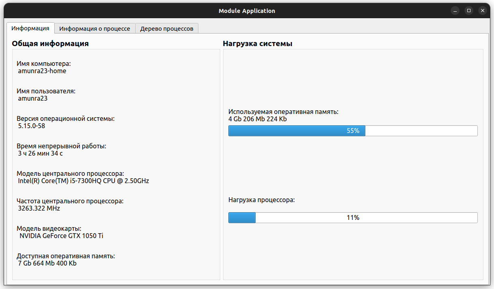

# Курсовая работа по Операционным Системам (семестр 7)

[Я в Телеграм](https://t.me/amunra2) 

## Общая информация

* **Тема**: Мониторинг информации об операционной системе Linux и ее процессах
* **Семестр**: 7
* **Язык**:
  * **Пользовательское приложение**: C++
  * **Загружаемый модуль ядра**: C
* **Операционная система**: Linux (выполнялось на Ubuntu 22.04)
* **РПЗ**: [ссылка](./docs/pdf/rpz_cvetkov.pdf)
* **ТЗ**: [ссылка](./docs/pdf/TZ.pdf)
* **Код**:
  * **Пользовательское приложение**: [ссылка](./src/module_application)
  * **Загружаемый модуль ядра**: [ссылка](./src/module)

## Пример UI

## Примечание

Для сборки LaTex требуется дополнительный файл настроек и лого, которые можно найти по [ссылке](https://github.com/amunra2/bmstu-iu7)

_@amunra2 (2022г.)_
